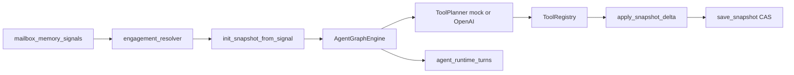

# Agent Runtime Architecture (PR-A–PR-G, zakres ograniczony)

**Status:** aktywna, lecz ograniczona mapa agent runtime PR-A–PR-G; przegląd 2026-07-13

## Cel

Jeden **Digital Twin operatora HVAC** na engagement: working state w `operator_engagement_snapshots`, epizody w `agent_runtime_turns`, semantyka w `AGENT_CONSTITUTION.md` (+ opcjonalny RAG). Dokument opisuje runtime agenta, nie pełną architekturę AI-OS. Operacyjnym SoT spraw pozostają journal i Postgres mailbox memory.

## Trzy warstwy pamięci

| Warstwa      | Magazyn                                                    | Zawartość                                                                            |
| ------------ | ---------------------------------------------------------- | ------------------------------------------------------------------------------------ |
| **Working**  | `operator_engagement_snapshots.snapshot_data`              | `EngagementSnapshotV2` — kanoniczny working snapshot agenta; nie zastępuje Case/Postgres SoT                                      |
| **Episodic** | `agent_runtime_turns`                                      | Każde wywołanie narzędzia: args (redacted), status, `turn_summary_pl`, `tokens_used` |
| **Semantic** | `docs/core/AGENT_CONSTITUTION.md` + pgvector (opcjonalnie) | Reguły HVAC, allowlist, HITL; `load_live(rag_enabled=True)`                          |

## Kontrakt `EngagementSnapshotV2`

- Pydantic strict (`extra=forbid`)
- JSON Schema: `docs/contracts/engagement_snapshot_v2.schema.json` (generowany z modelu)
- `operational_status.blocking` — jawna flaga blokady (np. po `report_gaps_and_stop`)
- **Zakazane w grafie:** `send_email`, `create_offerdto` — wykonanie tylko po HITL operatora

## Przepływ PR-B (graf)



Python **zawsze** zapisuje delta przez Pydantic; LLM tylko planuje `ToolCallPlan`.

## Spine ↔ engagement

- Kolumna `mailbox_memory_signals.engagement_id` (migracja `AGENT_RUNTIME_MIGRATIONS.sql`)
- `engagement_resolver.resolve_engagement_for_case()` — correlation_registry `mailbox_case`
- `signal_engagement.patch_signal_engagement()` — link po reconcile

## Bootstrap DB

`PostgresMailboxMemoryStore.bootstrap()` uruchamia:

1. mailbox memory schema
2. correlation registry
3. **`bootstrap_agent_runtime()`** — tabele operator + migracje signal

## Pliki kotwiczne

| Moduł       | Ścieżka                                                     |
| ----------- | ----------------------------------------------------------- |
| Kontrakt    | `tools/gmail_audit/llm_contracts/engagement_snapshot_v2.py` |
| Store       | `tools/gmail_audit/agent_runtime/store.py`                  |
| Turns       | `tools/gmail_audit/agent_runtime/turn_journal.py`           |
| Resolver    | `tools/gmail_audit/agent_runtime/engagement_resolver.py`    |
| Graf        | `tools/gmail_audit/agent_runtime/graph.py`                  |
| Konstytucja | `tools/gmail_audit/agent_runtime/constitution.py`           |

## PR-C — OpenAI + narzędzia

| Moduł                    | Rola                                                                           |
| ------------------------ | ------------------------------------------------------------------------------ |
| `openai_agent_client.py` | `OpenAIToolPlanner` — `tool_choice=auto` (Groq-compatible), `last_tokens_used` |
| `tools_registry.py`      | `AgentToolRegistry` + budżety + `policy_guardrails`                            |
| `tools/handlers.py`      | Gmail, Drive, Docling parse, RAG, CP2025, kalk-top, draft, gaps                |
| `drive_file_reader.py`   | Pobranie pliku Drive + łańcuch parserów                                        |
| `run.py`                 | `execute_agent_run()` — constitution `load_live`, turn journal, CAS save       |
| `validate.py`            | Walidacja env + `doctor` check `agent_runtime`                                 |

**Doctor:** `python gmail_intake.py doctor` raportuje `checks.agent_runtime`.

## PR-D — Spine → AgentRun (historyczny etap implementacyjny)

PR-D opisuje genezę spięcia agent runtime z reconcile. Aktualny kontrakt nadrzędny jest prostszy:

- `SIGNAL_RUNTIME_MODE=active` jest jedyną wspieraną ścieżką wejścia;
- canonical reconcile działa przez rejestr handlerów i wspólny downstream;
- agent runtime może działać jako ograniczona warstwa `prep`, ale nie zastępuje journalu, Case state ani policy;
- `AGENT_RUNTIME_MODE=primary` pozostaje zablokowany;
- historyczny legacy tail nie jest alternatywnym runtime.

Elementy nadal istotne:

1. rozwiązanie `engagement_id`/`case_id`;
2. inicjalizacja lub odczyt snapshotu agenta;
3. bounded `execute_agent_run`;
4. walidowany zapis snapshotu/turn journal;
5. projekcja do aktualnego feedu bez tworzenia drugiego SoT.

Źródłem aktualnego zachowania są `signal_reconciler.py`, `intake_shared_downstream.py`, `config.py`, testy oraz `SIGNAL_ACTIVE_ONLY.md`.

## PR-E — Daszek feed (historyczny adapter snapshotu)

PR-E wprowadził mapowanie `EngagementSnapshotV2` do widoków Daszka. Obecny kontrakt UI jest operational feed v3 schema 1.3:

- listy `desk`, `cases`, `action_items`, `case_details`, `day`;
- brak kanonicznej listy `tasks` w feedzie 1.3;
- Node B buduje i waliduje projekcję; Daszek ją przechowuje i renderuje;
- `read_only=true` oznacza brak wykonania po stronie feedu;
- stan decyzji/execution jest potwierdzany przez stable decision identity i świeżą projekcję, nie przez sam push HTTP;
- best-effort feed push nie jest execution checkpointem.

Historyczne funkcje `daszek_engagement_feed.py` mogą nadal wspierać bounded ścieżki, ale nie są osobnym źródłem prawdy ani pozwoleniem na schema drift. Aktualną mapę feedu opisują `PROJECT_README.md`, kontrakt v3 i LPS.

## PR-F — Primary cutover (historyczny; **primary zablokowany w kodzie**)

| Element                                | Stan w kodzie (2026-07)                                                                               |
| -------------------------------------- | ----------------------------------------------------------------------------------------------------- |
| `AGENT_RUNTIME_MODE=primary`           | **`ConfigError`** — `validate_agent_runtime_mode_not_primary()` w `config.py`                         |
| Dozwolony tryb agenta                  | **`prep`** (domyślny `DEFAULT_AGENT_RUNTIME_MODE`); HITL + policy guardrails                          |
| `evaluate_digital_twin_dod()`          | `agent_runtime/digital_twin_dod.py`; pytest gate: Radlin mock, engagement reconcile, HITL             |
| `legacy_downstream_reconcile_active()` | ConfigError gdy `enabled=1` + `mode=legacy`                                                           |
| `canonical_production`                 | Gdy `AGENT_RUNTIME_ENABLED=1`: wymaga OpenAI key; **nie** `mode=primary` (zablokowany przed profilem) |

Historyczny primary cutover nie jest aktywnym runbookiem; bieżący stan potwierdza `docs/runbooks/LAST_PROVEN_STATE.md`.
Testy: `tests/test_digital_twin_cel_radlin_dod.py`, `tests/test_agent_primary_mode_pr_f.py`.

## PR-G — MCP server (Cursor / audyt)

| Element                           | Zachowanie                                                                                                          |
| --------------------------------- | ------------------------------------------------------------------------------------------------------------------- |
| `agent_runtime/mcp_service.py`    | Logika narzędzi (testowalna bez SDK)                                                                                |
| `agent_runtime/mcp_server.py`     | stdio MCP (`mcp` package)                                                                                           |
| `gmail_intake.py agent-mcp-serve` | Entrypoint operacyjny                                                                                               |
| Narzędzia                         | `get_engagement_snapshot`, `list_active_engagements`, `trigger_agent_run`, `approve_hitl_action`, `get_agent_turns` |
| `approve_hitl_action`             | rejestruje approval/HITL w snapshotcie; nie jest samodzielnym dowodem wykonania skutku                               |
| Konfiguracja Cursor               | Operator-profile snippet: `docs/dev/mcp/snippets/agent-runtime.placeholder.jsonc`                                   |

| `scripts/agent_mcp_smoke_gate.py` | Gate in-process: wszystkie narzędzia MCP, exit 0 = PASS |
| `agent_runtime/fixtures/mcp_tool_catalog.json` | Katalog narzędzi dla audytu / CI |
| Filtry listy | `hitl_required_only`, `blocking_gaps_only`, `status` |
| `include_full` na get | Pełny JSON snapshot (ograniczone użycie) |

Operacje MCP traktuj jako debug/bounded tooling; bieżący proof pozostaje w LPS. Testy: `tests/test_agent_mcp_pr_g.py`, `tests/test_agent_mcp_pr_g_complete.py`.

## Rozszerzenie bezpieczeństwa decyzji (2026-07-13)

Agent runtime działa na deterministycznym kontrakcie execution:

```text
received → accepted → executing → executed | outcome_unknown | failed_before_execution → converged
received → accepted → rejected → converged
```

- stabilny `decision_key`/queue identity przechodzi przez Daszek, bridge i Node B;
- `accepted` nie jest dowodem wykonania;
- trwały execution result jest zapisany przed completion/projection;
- replay `executed`/`rejected` nie wywołuje executora ani drugiego finalnego eventu;
- `failed_before_execution` może być ponowiony;
- `outcome_unknown` wymaga jawnego recovery i nie jest automatycznie ponawiany;
- dwa równoległe drainery tej samej decyzji nie wykonują skutku dwa razy;
- finalne UI confirmation wymaga konwergencji fresh feedu dla tego samego decision key.

Główni właściciele: `agent_hitl_bridge.py`, `hitl_gmail_send.py`, `execution_runtime.py`, `daszek_bridge_queue_drain.py`, `agent_runtime/authz.py`, `api_app.py` oraz po stronie Node A `api-v3-handlers.php` i `public/app.js`.

Proof: `docs/runbooks/LAST_PROVEN_STATE.md` oraz `C:\ai-os-critical-findings-fix-20260713T122855Z`.

## Spine-first + case bootstrap (gap + workaround)

Spine-first intake (`process_snapshot`) + agent reconcile wymaga `case_id` w payload reconcile. Gdy entity link nie istnieje jeszcze w Postgres, agent reconcile może pominąć run.

**Workaround:** `agent_runtime/agent_reconcile.resolve_case_id_for_agent()` (`agent_runtime/agent_reconcile.py`) rozwiązuje `case_id` z entity linku, payloadu sygnału, hintów oraz — jako fallback — `fetch_case_by_message_id` na mailbox store, zamiast wymagać osobnego bootstrap kroku przed `process_snapshot`.

**Status:** traktuj jako ograniczenie tej historycznej ścieżki PR-A–PR-G. Aktualny signal-active runtime i proof opisują `docs/runbooks/SIGNAL_ACTIVE_ONLY.md` oraz `LAST_PROVEN_STATE.md`; nie odtwarzaj usuniętego runbooka ingest.

## Tryby runtime

`AGENT_RUNTIME_MODE`: kod dopuszcza wspierany tryb `prep`; `primary` pozostaje zablokowany, a aktywny signal spine nie przywraca legacy tail. Źródłem jest `config.py` i testy, nie historyczny plan `.cursor`.
